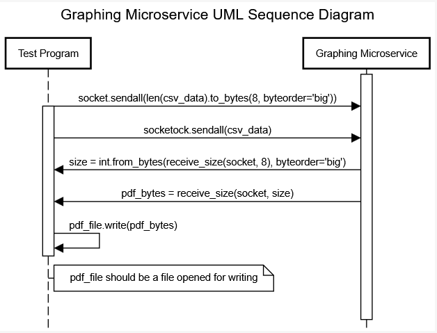

## How Does the Microservice Work?

1. You must first have a CSV file in the format x, y\nx, y\n etc.  
2. Then, call the microservice by connecting a socket to it at port 54338  
3. Then, send the size of the csv file you'll be sending with:

   ```python
   socket.sendall(len(data).to_bytes(8, byteorder='big'))
   ```

4. Then, send the file like this:

   ```python
   socketock.sendall(data)
   ```

5. The graphing microservice will then create a pdf of a graph of the data you sent it, and send that pdf back as a byte stream.

6. To recieve the data call like this:

   Get the size of the pdf we'll be recieving:

   ```python
   size = int.from_bytes(receive_size(socket, 8), byteorder='big')
   ```

   Recieve that many bytes from the socket:

   ```python
   pdf_bytes = receive_size(socket, size)
   ```

   Open a pdf file with a specified filename for writing (filename can be whatever you want):

   ```python
   pdf_file = open(filename, "wb")
   ```

   Seek to zero and truncate the file:

   ```python
   pdf_file.seek(0)
   pdf_file.truncate()
   ```

   Write the bytes recieved into the file:

   ```python
   pdf_file.write(pdf_bytes)
   ```

   Close the file (you're done):

   ```python
   pdf_file.close()
   ```

`receive_size()` should be a function defined to recieve a certain number of bytes of data from a socket.


---

| | |
|---|---|
| **REQUEST** | Send a CSV file to the socket at port 54338 |
| **RECEIVE** | Recieve the pdf as a byte stream and then write those bytes to created pdf file |

---

### Pros
- Easy to request data (you only need to send the file size, then the data)
- Simple CSV format for input.
- Because it uses sockets, it's very fast.

### Cons
- Only supports graphs with a single line.
- You must implement writing to a pdf yourself.
- The microservice can only handle one process at a time.


## UML Sequence Diagram:

